# Bifrost (بایفراست) ⚡

<div align="center">


**Ultra-Lightweight, Battery-Friendly Local SOCKS5 Bridge for Telegram over Cloudflare Workers (TWP)**  
*پل ارتباطی محلی، فوق‌سبک و بهینه میان تلگرام و ورکر کلادفلر بدون نیاز به فیلترشکن و روت*

[](https://t.me/Qorvhex_Channel)
[](https://github.com/Qorvhex/Bifrost)
[](https://github.com/Qorvhex/Bifrost)
[](https://kotlinlang.org)
[](LICENSE)

[**فارسی (Persian)**](#-بخش-فارسی-persian) | [**English**](#-english-section)

</div>

---

<a name="english-section"></a>
# 🌐 English Section

**Bifrost** is a next-generation local SOCKS5 bridge for Android that tunnels official Telegram MTProto traffic through Cloudflare Workers using the TWP protocol (MTProto-over-WebSocket). 

Unlike conventional VPN apps, Bifrost **does not use `VpnService`**, requires **no root**, displays **no VPN key icon**, and consumes **near-zero battery and CPU (0.0% idle)**.

---

## ✨ Key Features

- **Zero VpnService & No Root Required:** Runs purely on the local loopback (`127.0.0.1`). Only Telegram traffic is tunneled; system-wide networking and other apps remain untouched.
- **Wake-on-Demand (Zero-Idle Core):** Suspended at the Linux kernel level when Telegram is idle (0.0% CPU usage). Wakes up instantaneously upon receiving packets from Telegram and returns to deep sleep when done.
- **Cloudflare Clean IP / CDN IP Support:** Directly routes WebSocket handshakes to censorship-resistant Cloudflare Clean IPs, bypassing SNI filtering and blocked domains.
- **RFC 3986 Standardized URI Scheme:** Full support for standard `twp://` link formats:
  ```text
  twp://[secret@]workerHost[:port]?clean_ip=cleanIp#ConfigName
  ```
- **Zero-Click Deep Linking:** Tapping any `twp://` link or sharing a link to Bifrost automatically saves the configuration, starts the bridge in the background, and forwards directly to Telegram's native proxy confirmation screen.
- **Modern Jetpack Compose UI:** Cyberpunk dark aesthetics, floating action controls, instant QR code scanning (CameraX & ML Kit), and one-click Telegram setup.
- **Configurable Local Port:** Default is `5050`, customizable to any port between `1024` and `65535`.

---

## 🏛️ System Architecture

```mermaid
flowchart LR
    subgraph Android_Device ["Android Device"]
        TG["Official Telegram Client"]
        subgraph Bifrost_Bridge ["Bifrost Bridge (Zero-Idle Core)"]
            S5["Local SOCKS5 Server\n(127.0.0.1:5050)"]
            WS["WebSocket Client\n(OkHttp TLS 1.3)"]
            DNS["Clean IP Resolver"]
        end
    end

    subgraph Cloudflare ["Cloudflare Edge Network"]
        CF_IP["Clean IP / Anycast IP\n(e.g., 104.16.132.229)"]
        CF_Worker["Cloudflare Worker\n(worker.js / TWP)"]
    end

    subgraph Telegram_Infrastructure ["Telegram Infrastructure"]
        DC["Telegram Datacenter\n(e.g., 149.154.167.50:443)"]
    end

    TG -->|"SOCKS5 TCP (MTProto)"| S5
    S5 --> WS
    WS -->|"WSS Binary Frames (SNI: workerHost)"| DNS
    DNS -->|"TCP Connect to Clean IP:443"| CF_IP
    CF_IP --> CF_Worker
    CF_Worker -->|"cloudflare:sockets TCP"| DC
```



---

## 🛠️ Deploying Your Personal Cloudflare Worker Proxy

You can deploy your own private, unrestricted Telegram proxy in less than 2 minutes using Cloudflare Workers.

### Step 1: Get the Worker Script
The official worker script is open-source and hosted at:
👉 **[Qorvhex/TWP - worker.js](https://github.com/Qorvhex/TWP/blob/main/worker.js)**

### Step 2: Deploy to Cloudflare Workers
1. Log in to your [Cloudflare Dashboard](https://dash.cloudflare.com/).
2. Navigate to **Workers & Pages** > **Overview** > **Create application** > **Create Worker**.
3. Name your worker (e.g., `my-telegram-proxy`) and click **Deploy**.
4. Click **Edit code**.
5. Replace all existing code in `worker.js` with the code from [TWP worker.js](https://github.com/Qorvhex/TWP/blob/main/worker.js).
6. Click **Save and deploy**.

### Step 3: (Optional) Set a Secret Token
To prevent unauthorized usage:
1. Go to your Worker's **Settings** > **Variables and Secrets**.
2. Click **Add variable**:
   - Variable name: `SECRET`
   - Value: `YourSecretToken`
3. Click **Save and deploy**.

### Step 4: Import into Bifrost
Generate your link:
```text
twp://my-telegram-proxy.your-subdomain.workers.dev?clean_ip=1music.cc#MyWorker
```
*(If you configured a secret, use `twp://YourSecretToken@my-telegram-proxy.your-subdomain.workers.dev?clean_ip=1music.cc#MyWorker`)*

In **Bifrost**, tap **+** > **Paste from Clipboard** or scan the QR code. Tap the proxy card, and click **Connect Telegram**!

---

## 🔗 Standard URI Specification (`twp://`)

Bifrost follows the standard **RFC 3986** URI convention used by all modern proxy protocols (like VLESS, Trojan, and Shadowsocks):

```text
twp://[secret@]workerHost[:port]?clean_ip=cleanIp#ConfigName
```

| Parameter | Type | Required | Default | Description |
| :--- | :--- | :--- | :--- | :--- |
| `workerHost` | Authority / Host | **Yes** | — | Cloudflare Worker domain (e.g., `proxy.workers.dev`) |
| `secret` | Userinfo (`secret@`) | No | — | Authentication token matching Worker's `SECRET` |
| `port` | Authority (`:port`) | No | `443` | Worker HTTPS/WSS port |
| `clean_ip` | Query (`?clean_ip=`) | No | — | Cloudflare Clean IP or CDN domain (e.g., `104.16.132.229`) |
| `ConfigName` | Fragment (`#Name`) | No | `workerHost` | Custom label displayed in the app |

---

## 📲 Telegram Connection Quick Setup

1. Open **Bifrost** and activate your worker.
2. Tap **Connect Telegram** (or tap the floating Power FAB to toggle the bridge on/off).
3. Telegram will open directly with the proxy setup screen:
   - **Type:** SOCKS5
   - **Server:** `127.0.0.1`
   - **Port:** `5050`
   - **Credentials:** Empty
4. Tap **Enable Proxy**. Your Telegram is now connected through your personal Cloudflare Worker!

---

## 💻 Building from Source

### Automated GitHub Actions Build (Recommended)
This repository includes a turnkey CI/CD workflow ([`.github/workflows/build.yml`](.github/workflows/build.yml)):
- Automatically compiles, signs, and uploads release APKs with every push.
- To use custom production signing keys, add `KEYSTORE_BASE64`, `KEY_ALIAS`, `KEYSTORE_PASSWORD`, and `KEY_PASSWORD` to your repository secrets.

### Local Android Studio Build
```bash
git clone https://github.com/Qorvhex/Bifrost.git
cd Bifrost
./gradlew assembleDebug
```
The APK will be generated at `app/build/outputs/apk/debug/app-debug.apk`.

---
---

<a name="بخش-فارسی-persian"></a>
# 🇮🇷 بخش فارسی (Persian)

**Bifrost (بایفراست)** یک پل ارتباطی محلی (Local SOCKS5 Bridge) فوق‌سبک، مدرن و با مصرف باتری نزدیک به صفر برای سیستم‌عامل اندروید است. این برنامه بدون نیاز به سرویس‌های سنگین VPN، بدون نیاز به روت و بدون تغییر در ترافیک سایر اپلیکیشن‌های گوشی، ترافیک پروتکل MTProto تلگرام را از طریق ورکر کلادفلر (پروتکل TWP: MTProto-over-WebSocket) به دیتاسنترهای رسمی تلگرام می‌رساند.

---

## 🌟 ویژگی‌های برجسته

- **بدون نیاز به VPN و بدون روت (No VpnService / Zero Root):** ارتباط روی آدرس لوکال (`127.0.0.1`) انجام می‌شود. آیکون کلید VPN در بالای صفحه ظاهر نمی‌شود و اینترنت سایر برنامه‌ها کاملاً عادی و بدون تغییر باقی می‌ماند.
- **معماری بیداری در صورت نیاز (Zero-Idle Core):** در زمان بسته بودن تلگرام یا عدم تبادل پیام، مصرف پردازنده دقیقاً **۰.۰٪** است. به محض ارسال یا دریافت پیام، برنامه فوراً بیدار شده و پس از اتمام کار مجدداً به خواب سبک می‌رود.
- **پشتیبانی کامل از آی‌پی تمیز (Clean IP / CDN IP):** قابلیت اتصال مستقیم به آی‌پی‌ها یا دامنه‌های تمیز کلادفلر جهت دور زدن اختلالات شدید اینترنت و مسدودی دامنه‌ها.
- **ساختار استاندارد جهانی لینک‌ها (RFC 3986):** ساختار لینک‌های `twp://` دقیقاً مشابه استانداردهای جهانی پروکسی‌ها (VLESS، Trojan و Shadowsocks) بازنویسی شده است.
- **دیپلینک بدون وقفه (Zero-Click Deep Link):** با کلیک روی هر لینک `twp://` یا اشتراک آن در بایفراست، کانفیگ فوراً در پس‌زمینه ذخیره و فعال شده و مستقیماً صفحه ست کردن پروکسی در تلگرام باز می‌شود.
- **رابط کاربری مدرن (Jetpack Compose & Material 3):** طراحی دارک نئونی، اسکنر سریع QR Code با هوش مصنوعی ML Kit، دکمه شناور پاور و اتصال با یک کلیک به تلگرام.
- **پورت محلی قابل تنظیم:** پورت پیش‌فرض `5050` است و در صورت نیاز از طریق تنظیمات بالا قابل تغییر است.

---

## 🛠️ آموزش جامع راه‌اندازی پروکسی شخصی در کلادفلر (Cloudflare Worker)

شما می‌توانید با اسکریپت رسمی TWP در کمتر از ۲ دقیقه یک پروکسی شخصی و نامحدود برای خود بسازید:

### مرحله ۱: دریافت کد اسکریپت ورکر
سورس کد رسمی ورکر در مخزن زیر قرار دارد:
👉 **[کد اسکریپت worker.js در گیت‌هاب Qorvhex/TWP](https://github.com/Qorvhex/TWP/blob/main/worker.js)**

### مرحله ۲: ساخت و راه‌اندازی ورکر در کلادفلر
1. وارد داشبورد حساب خود در [Cloudflare Dashboard](https://dash.cloudflare.com/) شوید.
2. از منوی سمت چپ به بخش **Workers & Pages** > **Overview** بروید.
3. روی دکمه **Create application** و سپس **Create Worker** کلیک کنید.
4. یک نام دلخواه برای ورکر خود وارد کنید (مثال: `my-telegram-proxy`) و دکمه **Deploy** را بزنید.
5. پس از ساخته شدن، روی دکمه **Edit code** کلیک کنید.
6. تمامی کدهای موجود در فایل `worker.js` را پاک کرده و کدهای کپی‌شده از [worker.js گیت‌هاب](https://github.com/Qorvhex/TWP/blob/main/worker.js) را در آن جای‌گذاری (Paste) کنید.
7. روی دکمه **Save and deploy** کلیک کنید.

### مرحله ۳: تنظیم پسورد و رمز عبور (اختیاری جهت حفظ امنیت)
اگر می‌خواهید پروکسی شما خصوصی باشد و دیگران نتوانند از آن استفاده کنند:
1. در صفحه ورکر خود به تب **Settings** و سپس بخش **Variables and Secrets** بروید.
2. روی **Add variable** کلیک کنید:
   - نام متغیر: `SECRET`
   - مقدار: رمز عبور دلخواه شما (مثال: `MySecret123`)
3. دکمه **Save and deploy** را بزنید.

### مرحله ۴: ساخت لینک و ورود به بایفراست
لینک شما به شکل زیر خواهد بود:
```text
twp://my-telegram-proxy.your-subdomain.workers.dev?clean_ip=1music.cc#ورکر_من
```
*(در صورت تنظیم پسورد: `twp://MySecret123@my-telegram-proxy.your-subdomain.workers.dev?clean_ip=1music.cc#ورکر_من`)*

کافیست این لینک را کپی کرده، در بایفراست دکمه **+** را بزنید و **Paste from Clipboard** را انتخاب کنید. سپس روی کارت کانفیگ ضربه بزنید و دکمه **Connect Telegram** را لمس کنید!

---

## 🔗 ساختار استاندارد لینک‌ها (`twp://`)

لینک‌های کانفیگ بایفراست از استاندارد **RFC 3986** پیروی می‌کنند:

```text
twp://[secret@]workerHost[:port]?clean_ip=cleanIp#نام_کانفیگ
```

| پارامتر | جایگاه در لینک | الزامی؟ | پیش‌فرض | توضیحات |
| :--- | :--- | :--- | :--- | :--- |
| `workerHost` | بخش Host | **بله** | — | آدرس دامنه ورکر کلادفلر شما (مثال: `my-worker.workers.dev`) |
| `secret` | بخش UserInfo (`secret@`) | خیر | — | پسورد احراز هویت تنظیم‌شده در سکرت ورکر |
| `port` | بخش پورت (`:port`) | خیر | `443` | پورت ورکر کلادفلر |
| `clean_ip` | پارامتر کوئری (`?clean_ip=`) | خیر | — | آی‌پی یا دامنه تمیز کلادفلر (مثال: `1music.cc`) |
| `نام_کانفیگ` | فرگمنت (`#نام`) | خیر | `workerHost` | نام نمایشی دلخواه برای کانفیگ |

---

## 🚀 راهنمای اتصال سریع در تلگرام

1. برنامه **Bifrost** را باز کرده و کانفیگ خود را فعال کنید.
2. دکمه **Connect Telegram** را لمس کنید (یا با دکمه شناور پاور وضعیت پل را فعال نمایید).
3. تلگرام مستقیماً با صفحه تایید پروکسی باز می‌شود:
   - **نوع پروکسی:** SOCKS5
   - **سرور (Server):** `127.0.0.1`
   - **پورت (Port):** `5050`
   - **نام کاربری و رمز عبور:** خالی
4. روی **Enable Proxy** کلیک کنید. اتصال تلگرام اکنون برقرار است!

---

## 📢 کانال اطلاع‌رسانی و پشتیبانی

برای دریافت آخرین آپدیت‌ها، آی‌پی‌های تمیز جدید و آموزش‌های تکمیلی به کانال تلگرام ما بپیوندید:

👉 **[کانال رسمی تلگرام: @Qorvhex_Channel](https://t.me/Qorvhex_Channel)**  
👉 **[مخزن سورس ورکر: Qorvhex/TWP](https://github.com/Qorvhex/TWP)**

---

## 📄 لایسنس
این پروژه به صورت متن‌باز تحت لایسنس **MIT** منتشر شده است.
