# Bifrost (بایفراست) ⚡

**Bifrost** یک پل ارتباطی محلی (Local SOCKS5 Bridge) فوق‌سبک، مدرن و با مصرف باتری نزدیک به صفر برای سیستم‌عامل اندروید است. این اپلیکیشن بدون نیاز به `VpnService`، بدون نیاز به روت و بدون نمایش آیکون کلید VPN در استاتوس‌بار، ترافیک MTProto کلاینت رسمی تلگرام را دریافت کرده، به فریم‌های امن وب‌سوکت تبدیل می‌کند و از طریق ورکر کلادفلر (پروتکل TWP: MTProto-over-WebSocket) به دیتاسنترهای تلگرام می‌رساند.

---

## 🌟 ویژگی‌های کلیدی (Key Features)

- **بدون نیاز به VPN (No VpnService / Zero Root):** ارتباط کاملاً بر بستر شبکه محلی (`127.0.0.1`) برقرار می‌شود و هیچ‌گونه ترافیک کل دستگاه یا برنامه‌های دیگر دستکاری نمی‌شود.
- **مکانیزم بیداری در صورت نیاز (Wake-on-Demand / Zero-Idle):**
  - در زمان عدم فعالیت تلگرام، مصرف CPU و منابع دستگاه **0.0%** است (کرنل اندروید ترد را در حالت انتظار معلق نگه می‌دارد).
  - به محض ارسال اولین پکت داده توسط تلگرام، پل ارتباطی فوراً فعال شده و داده‌ها را رد و بدل می‌کند و پس از اتمام تبادل، مجدداً به خواب سبک می‌رود.
- **پشتیبانی کامل از آی‌پی تمیز (Clean IP / CDN IP):**
  - امکان هدایت مستقیم ترافیک به آی‌پی‌های تمیز کلادفلر جهت دور زدن اختلالات SNI و مسدودی دامنه‌ها.
  - تعبیه مستقیم پارامتر `clean_ip` در ساختار استاندارد لینک `twp://`.
- **دیپلینک بدون کلیک (Zero-Click Deep Link):**
  - باز کردن خودکار لینک‌های `twp://` از هر پیام‌رسان یا مرورگر، ذخیره و فعال‌سازی آنی در پس‌زمینه و باز کردن مستقیم کلاینت رسمی تلگرام با صفحه تایید پروکسی محلی.
- **رابط کاربری مدرن (Jetpack Compose & Material 3):**
  - تم دارکمود عمیق با سبک خطی و مینیمال (Line / Outline Style).
  - کلیک روی هر کارت جهت فعال‌سازی آنی.
  - دکمه شناور با ۳ قابلیت: افزودن دستی، خواندن هوشمند از کلیپ‌بورد، اسکنر سریع QR Code (مجهز به CameraX و Google ML Kit).
  - مدال اختصاصی اشتراک‌گذاری حاوی QR Code تولید شده با ZXing و دکمه کپی لینک کامل.
- **پورت محلی قابل تنظیم:** پورت پیش‌فرض `5050` است و در تنظیمات قابل تغییر به هر پورت دلخواه (1024-65535) می‌باشد.

---

## 🏛️ معماری سیستم (System Architecture)

```mermaid
flowchart LR
    subgraph Android_Device ["دستگاه اندرویدی (Android Device)"]
        TG["Official Telegram Client"]
        subgraph Bifrost_Bridge ["اپلیکیشن Bifrost (Zero-Idle Core)"]
            S5["Local SOCKS5 Server\n(127.0.0.1:5050)"]
            WS["WebSocket Bridge\n(OkHttp TLS 1.3)"]
            DNS["Clean IP DNS Resolver"]
        end
    end
    subgraph Cloudflare ["شبکه کلادفلر (Cloudflare Edge)"]
        CF_IP["Clean IP / Anycast IP"]
        CF_Worker["Cloudflare Worker\n(worker.js / TWP)"]
    end
    subgraph Telegram_DC ["زیرساخت تلگرام"]
        DC["Telegram DC\n(149.154.167.50:443)"]
    end

    TG -->|"SOCKS5 TCP\n(MTProto)"| S5
    S5 --> WS
    WS -->|"WSS Binary Frames\n(SNI: worker.host)"| DNS
    DNS -->|"TCP Connect to Clean IP:443"| CF_IP
    CF_IP --> CF_Worker
    CF_Worker -->|"TCP Socket (cloudflare:sockets)"| DC
```



---

## 🔗 استاندارد لینک اختصاصی (`twp://`)

لینک‌های اشتراک‌گذاری و وارد کردن پروکسی در Bifrost از استاندارد `twp://` تبعیت می‌کنند:

### ساختار لینک:
```text
twp://<worker_host>[:<port>]?clean_ip=<clean_ip>&secret=<secret>&port=<port>#<name>
```

| فیلد | وضعیت | پیش‌فرض | توضیحات |
| :--- | :--- | :--- | :--- |
| `worker_host` | **اجباری** | - | دامنه ورکر کلادفلر (مثال: `my-proxy.workers.dev`) |
| `clean_ip` | اختیاری | - | آی‌پی تمیز کلادفلر (مثال: `104.16.132.229`) |
| `secret` | اختیاری | - | توکن احراز هویت متغیر محیطی `SECRET` ورکر |
| `port` | اختیاری | `443` | پورت ورکر کلادفلر |
| `name` | اختیاری | `worker_host` | نام یا برچسب کانفیگ (در فرگمنت یا کوئری) |

### مثال‌ها:
```text
twp://my-proxy.workers.dev?clean_ip=104.16.132.229&secret=MyToken#CF_Worker_1
twp://edge.example.com?clean_ip=172.67.180.12#Fast
twp://worker.domain.workers.dev
```

> [!TIP]
> Bifrost همچنین از لینک‌های `tg://worker?...` پروژه اصلی TWP نیز به صورت خودکار پشتیبانی می‌کند.

---

## 🚀 راهنمای راه‌اندازی سریع در تلگرام

1. برنامه **Bifrost** را باز کنید.
2. با کلیک روی دکمه `+`، ورکر کلادفلر خود را وارد کنید (یا از طریق QR Code اسکن کنید).
3. روی کارت ورکر ضربه بزنید تا به عنوان ورکر فعال انتخاب شود.
4. دکمه **Connect Telegram** را بزنید یا در تلگرام وارد مسیر زیر شوید:
   - **Settings** > **Data and Storage** > **Proxy Settings** > **Add Proxy**
   - نوع: **SOCKS5**
   - سرور (Server): `127.0.0.1`
   - پورت (Port): `5050` (یا پورتی که در برنامه تنظیم کردید)
   - نام کاربری و پسورد: خالی بگذارید.
5. ذخیره کنید. اتصال تلگرام اکنون از طریق ورکر کلادفلر برقرار است!

---

## 🛠️ بیلد و استقرار خودکار با GitHub Actions (CI/CD)

مخزن مجهز به پایپلاین اتوماسیون کامل در مسیر [`.github/workflows/build.yml`](.github/workflows/build.yml) است:

- **خروجی گرفتن خودکار:** با هر Push یا Pull Request روی برنچ اصلی، فایل APK به صورت خودکار کامپایل شده و در بخش **Artifacts** اکشنز آپلود می‌شود.
- **کش هوشمند وابستگی‌ها:** با بهره‌گیری از `gradle/actions/setup-gradle@v4`.
- **مدیریت Keystore:** در صورتی که سکرت‌های Release Keystore تنظیم نشده باشند، بیلد متوقف نمی‌شود و نسخه **Debug APK** را خروجی می‌دهد.
- **تنظیم سکرت‌های انتشار (Release Signing):**
  جهت ساخت خروجی ساین شده، سکرت‌های زیر را در مسیر `Repository Settings > Secrets and variables > Actions` اضافه کنید:
  - `KEYSTORE_BASE64`: محتوای فایل jks کدگذاری شده با Base64
  - `KEY_ALIAS`: نام الیاس کلید
  - `KEYSTORE_PASSWORD`: پسورد فایل Keystore
  - `KEY_PASSWORD`: پسورد کلید

---

## 💻 بیلد محلی در Android Studio

1. مخزن را کلون کنید:
   ```bash
   git clone https://github.com/your-username/Bifrost.git
   ```
2. پروژه را در **Android Studio** باز کنید.
3. اجازه دهید گریدل وابستگی‌ها را سینک کند (نیاز به JDK 17).
4. تسک `assembleDebug` را اجرا کنید:
   ```bash
   ./gradlew assembleDebug
   ```
   فایل APK در مسیر `app/build/outputs/apk/debug/app-debug.apk` تولید می‌شود.

---

## 📄 لایسنس
این پروژه تحت لایسنس MIT منتشر شده است.
