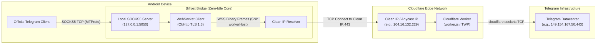

# Bifrost (بایفراست) ⚡

<div align="center">


**Ultra-Lightweight, Battery-Friendly Local SOCKS5 Bridge for Telegram over Cloudflare Workers (TWP)**  
*پل ارتباطی محلی، فوق‌سبک و بهینه میان تلگرام و ورکر کلادفلر بدون نیاز به فیلترشکن و روت*

[](https://t.me/Qorvhex_Channel)
[](https://github.com/Qorvhex/Bifrost)
[](https://github.com/Qorvhex/Bifrost)
[](https://kotlinlang.org)
[](LICENSE)

[**فارسی (Persian)**](#-بخش-فارسی-persian) | [**English**](#-english-section)

</div>

---

<a name="english-section"></a>
# 🌐 English Section

**Bifrost** is a next-generation local SOCKS5 bridge for Android that tunnels official Telegram MTProto traffic through Cloudflare Workers using the TWP protocol (MTProto-over-WebSocket). 

Unlike conventional VPN apps, Bifrost **does not use `VpnService`**, requires **no root**, displays **no VPN key icon**, and consumes **near-zero battery and CPU (0.0% idle)**.

---

## ✨ Key Features

- **Zero VpnService & No Root Required:** Runs purely on the local loopback (`127.0.0.1`). Only Telegram traffic is tunneled; system-wide networking and other apps remain untouched.
- **Wake-on-Demand (Zero-Idle Core):** Suspended at the Linux kernel level when Telegram is idle (0.0% CPU usage). Wakes up instantaneously upon receiving packets from Telegram and returns to deep sleep when done.
- **Cloudflare Clean IP / CDN IP Support:** Directly routes WebSocket handshakes to censorship-resistant Cloudflare Clean IPs, bypassing SNI filtering and blocked domains.
- **RFC 3986 Standardized URI Scheme:** Full support for standard `twp://` link formats:
  ```text
  twp://[secret@]workerHost[:port]?clean_ip=cleanIp#ConfigName
  ```
- **Zero-Click Deep Linking:** Tapping any `twp://` link or sharing a link to Bifrost automatically saves the configuration, starts the bridge in the background, and forwards directly to Telegram's native proxy confirmation screen.
- **Automated In-App Cloudflare Deployer:** Create, deploy, and activate your personal Cloudflare Worker proxy directly inside the app with zero manual coding.
- **Run on Startup:** Optional background service auto-start upon phone boot or reboot to ensure uninterrupted proxy access.
- **Full Bilingual Support:** Native English and Persian (فارسی) language support with beautiful Persian typography.
- **In-App Update Checker:** One-tap GitHub update verification to keep your client on the latest version.
- **Modern Jetpack Compose UI:** Cyberpunk dark aesthetics, floating action controls, instant QR code scanning (CameraX & ML Kit), and one-click Telegram setup.
- **Configurable Local Port:** Default is `5050`, customizable in Settings between `1024` and `65535`.

---

## 🏛️ System Architecture


```mermaid
flowchart LR
    subgraph Android_Device ["Android Device"]
        TG["Official Telegram Client"]
        subgraph Bifrost_Bridge ["Bifrost Bridge (Zero-Idle Core)"]
            S5["Local SOCKS5 Server\n(127.0.0.1:5050)"]
            WS["WebSocket Client\n(OkHttp TLS 1.3)"]
            DNS["Clean IP Resolver"]
        end
    end

    subgraph Cloudflare ["Cloudflare Edge Network"]
        CF_IP["Clean IP / Anycast IP\n(e.g., 104.16.132.229)"]
        CF_Worker["Cloudflare Worker\n(worker.js / TWP)"]
    end

    subgraph Telegram_Infrastructure ["Telegram Infrastructure"]
        DC["Telegram Datacenter\n(e.g., 149.154.167.50:443)"]
    end

    TG -->|"SOCKS5 TCP (MTProto)"| S5
    S5 --> WS
    WS -->|"WSS Binary Frames (SNI: workerHost)"| DNS
    DNS -->|"TCP Connect to Clean IP:443"| CF_IP
    CF_IP --> CF_Worker
    CF_Worker -->|"cloudflare:sockets TCP"| DC
```

---

## 🛠️ Deploying Your Personal Cloudflare Worker Proxy

You can set up your private, high-speed Telegram proxy using either the **Automated In-App Deployer** (recommended, takes ~30 seconds) or the **Manual Dashboard Setup**.

### Method 1: 1-Click Automated In-App Deployment (Recommended) 🚀
Bifrost includes a built-in automated deployer that connects directly to the Cloudflare API, provisions the worker, deploys the latest TWP script, and activates your proxy automatically with zero coding:

1. **Sign in to Cloudflare:** Make sure you have an active, free Cloudflare account at [dash.cloudflare.com](https://dash.cloudflare.com/) and are signed in on your mobile browser.
2. **Open Settings in Bifrost:** Open the app and tap the **Settings** (⚙️) icon at the top right of the screen.
3. **Tap "Create Proxy":** Tap the **Create Proxy** button at the top of the Settings dialog.
4. **Get Your API Key:** Tap **Get API Key from Cloudflare**. This automatically opens Cloudflare in your browser with the exact permissions (`Workers Scripts: Edit`) pre-selected.
5. **Create & Copy Token:** On the Cloudflare web page, scroll to the bottom, click the blue **Continue to summary** button, and then click **Create Token**. Copy the generated API token (note: Cloudflare displays this token only once).
6. **Deploy:** Return to Bifrost, paste the token into the **Cloudflare API Token** field, and optionally enter a custom password in **Worker Secret Key** if you wish to restrict proxy access.
7. **Complete:** Tap **Create Proxy**. Bifrost will automatically deploy the worker script, fetch your `.workers.dev` subdomain, and add the proxy to your active list ready for immediate use!

---

### Method 2: Manual Cloudflare Dashboard Setup (Advanced) ⚙️
If you prefer creating and deploying the worker manually via your desktop or browser:

#### Step 1: Copy the Worker Script
Get the official TWP proxy script from GitHub:
👉 **[Raw worker.js Code](https://raw.githubusercontent.com/Qorvhex/TWP/refs/heads/main/worker.js)** (or view the [TWP Repository](https://github.com/Qorvhex/TWP))

#### Step 2: Create Worker in Cloudflare
1. Log in to your [Cloudflare Dashboard](https://dash.cloudflare.com/).
2. From the left sidebar, navigate to **Workers & Pages** > **Create application** > **Create Worker**.
3. Choose a name for your worker (e.g., `my-proxy`) and click **Deploy**.
4. Once deployed, click **Edit code**.
5. Replace all existing placeholder code in the editor with the script copied from **worker.js**.
6. Click **Save and deploy** (or **Deploy**).

#### Step 3: (Optional) Set a Secret Password
To prevent unauthorized users from using your worker's bandwidth:
1. In your Worker's dashboard, navigate to **Settings** > **Variables and Secrets**.
2. Click **Add variable** (or **Add** under Variables):
   - Variable name: `SECRET`
   - Value: Your chosen password (e.g., `MySecret123`)
3. Click **Save and deploy**.

#### Step 4: Import into Bifrost
Your proxy domain will be `my-proxy.your-subdomain.workers.dev`. You can import it into Bifrost in two ways:

* **Direct Manual Entry:** In Bifrost, tap the **+** (FAB) button at the bottom > choose **Manual Input** > enter your Worker domain, Secret (if configured), and Clean IP.
* **Via `twp://` Link:** Construct your link and copy it to your clipboard:
  ```text
  twp://my-proxy.your-subdomain.workers.dev?clean_ip=1music.cc#MyProxy
  ```
  *(If password protected: `twp://MySecret123@my-proxy.your-subdomain.workers.dev?clean_ip=1music.cc#MyProxy`)*  
  Then in Bifrost, tap **+** > **Paste from Clipboard**.

> 💡 **What is Clean IP?** If your ISP blocks or throttles `*.workers.dev` subdomains, specifying a Clean IP or Cloudflare CDN domain (e.g., `1music.cc` or an uncensored Cloudflare Anycast IP) in `clean_ip` enables direct, smooth WebSocket handshakes without censorship.

---

## 🔗 Standard URI Specification (`twp://`)

Bifrost follows the standard **RFC 3986** URI convention used by all modern proxy protocols (like VLESS, Trojan, and Shadowsocks):

```text
twp://[secret@]workerHost[:port]?clean_ip=cleanIp#ConfigName
```

| Parameter | Type | Required | Default | Description |
| :--- | :--- | :--- | :--- | :--- |
| `workerHost` | Authority / Host | **Yes** | — | Cloudflare Worker domain (e.g., `proxy.workers.dev`) |
| `secret` | Userinfo (`secret@`) | No | — | Authentication token matching Worker's `SECRET` |
| `port` | Authority (`:port`) | No | `443` | Worker HTTPS/WSS port |
| `clean_ip` | Query (`?clean_ip=`) | No | — | Cloudflare Clean IP or CDN domain (e.g., `104.16.132.229`) |
| `ConfigName` | Fragment (`#Name`) | No | `workerHost` | Custom label displayed in the app |

---

## 📲 Telegram Connection Quick Setup

1. Open **Bifrost** and activate your worker.
2. Tap **Connect Telegram** (or tap the floating Power FAB to toggle the bridge on/off).
3. Telegram will open directly with the proxy setup screen:
   - **Type:** SOCKS5
   - **Server:** `127.0.0.1`
   - **Port:** `5050`
   - **Credentials:** Empty
4. Tap **Enable Proxy**. Your Telegram is now connected through your personal Cloudflare Worker!

---

## 💻 Building from Source

### Automated GitHub Actions Build (Recommended)
This repository includes a turnkey CI/CD workflow ([`.github/workflows/build.yml`](.github/workflows/build.yml)):
- Automatically compiles, signs, and uploads release APKs with every push.
- To use custom production signing keys, add `KEYSTORE_BASE64`, `KEY_ALIAS`, `KEYSTORE_PASSWORD`, and `KEY_PASSWORD` to your repository secrets.

### Local Android Studio Build
```bash
git clone https://github.com/Qorvhex/Bifrost.git
cd Bifrost
./gradlew assembleDebug
```
The APK will be generated at `app/build/outputs/apk/debug/app-debug.apk`.
---

## 🖥️ Community Desktop Clients (Unofficial)

- [Bifrost for Windows](https://github.com/BlueCat-dev/Bifrost-Windows): Independent third-party client. *Note: This port is independently developed; the Bifrost core project does not audit, maintain, or assume any liability for third-party binaries. Use at your own risk.*

---
---

<a name="بخش-فارسی-persian"></a>
#  بخش فارسی (Persian)

**Bifrost (بایفراست)** یک پل ارتباطی محلی (Local SOCKS5 Bridge) فوق‌سبک، مدرن و با مصرف باتری نزدیک به صفر برای سیستم‌عامل اندروید است. این برنامه بدون نیاز به سرویس‌های سنگین VPN، بدون نیاز به روت و بدون تغییر در ترافیک سایر اپلیکیشن‌های گوشی، ترافیک پروتکل MTProto تلگرام را از طریق ورکر کلادفلر (پروتکل TWP: MTProto-over-WebSocket) به دیتاسنترهای رسمی تلگرام می‌رساند.

---

## 🌟 ویژگی‌های برجسته

- **بدون نیاز به VPN و بدون روت (No VpnService / Zero Root):** ارتباط روی آدرس لوکال (`127.0.0.1`) انجام می‌شود. آیکون کلید VPN در بالای صفحه ظاهر نمی‌شود و اینترنت سایر برنامه‌ها کاملاً عادی و بدون تغییر باقی می‌ماند.
- **معماری بیداری در صورت نیاز (Zero-Idle Core):** در زمان بسته بودن تلگرام یا عدم تبادل پیام، مصرف پردازنده دقیقاً **۰.۰٪** است. به محض ارسال یا دریافت پیام، برنامه فوراً بیدار شده و پس از اتمام کار مجدداً به خواب سبک می‌رود.
- **پشتیبانی کامل از آی‌پی تمیز (Clean IP / CDN IP):** قابلیت اتصال مستقیم به آی‌پی‌ها یا دامنه‌های تمیز کلادفلر جهت دور زدن اختلالات شدید اینترنت و مسدودی دامنه‌ها.
- **ساختار استاندارد جهانی لینک‌ها (RFC 3986):** ساختار لینک‌های `twp://` دقیقاً مشابه استانداردهای جهانی پروکسی‌ها (VLESS، Trojan و Shadowsocks) بازنویسی شده است.
- **دیپلینک بدون وقفه (Zero-Click Deep Link):** با کلیک روی هر لینک `twp://` یا اشتراک آن در بایفراست، کانفیگ فوراً در پس‌زمینه ذخیره و فعال شده و مستقیماً صفحه ست کردن پروکسی در تلگرام باز می‌شود.
- **ساخت خودکار و یک‌کلیکه پروکسی:** ساخت و استقرار مستقیم ورکر در اکانت کلادفلر بدون نیاز به کدنویسی از داخل بخش تنظیمات برنامه.
- **اجرای خودکار هنگام روشن شدن گوشی (Run on Startup):** راه‌اندازی و اتصال مجدد خودکار پروکسی پس از بالا آمدن یا ری‌استارت دستگاه.
- **پشتیبانی کامل دوزبانه (فارسی و انگلیسی):** رابط کاربری فارسی روان با فونت وزیر و امکان تغییر سریع زبان از تنظیمات.
- **بررسی بروزرسانی درون برنامه:** بررسی نسخه جدید در گیتهاب با یک ضربه و لینک مستقیم دانلود.
- **رابط کاربری مدرن (Jetpack Compose & Material 3):** طراحی دارک نئونی، اسکنر سریع QR Code با هوش مصنوعی ML Kit، دکمه شناور پاور و اتصال با یک کلیک به تلگرام.
- **پورت محلی قابل تنظیم:** پورت پیش‌فرض `5050` است و در صورت نیاز از طریق تنظیمات برنامه قابل تغییر است.

---

## 🛠️ آموزش راه‌اندازی پروکسی شخصی در کلادفلر (Cloudflare Worker)

شما می‌توانید با دو روش، پروکسی شخصی، اختصاصی و پرسرعت خود را راه‌اندازی کنید: **روش خودکار و یک‌کلیکه داخل اپلیکیشن** (پیشنهادی - کمتر از ۳۰ ثانیه) یا **روش دستی در پنل کلادفلر**.

### روش ۱: ساخت و استقرار خودکار و یک‌کلیکه داخل برنامه (پیشنهادی) 🚀
برنامه بایفراست مجهز به سیستم استقرار خودکار است که مستقیماً از طریق API رسمی کلادفلر، ورکر را برای شما ساخته، کدنویسی و فعال کرده و به لیست پروکسی‌ها اضافه می‌کند:

۱. **داشتن حساب کلادفلر:** ابتدا در سایت [dash.cloudflare.com](https://dash.cloudflare.com/sign-up) یک حساب کاربری رایگان بسازید و در مرورگر گوشی وارد حساب خود شوید.
۲. **باز کردن تنظیمات در بایفراست:** برنامه بایفراست را باز کنید و روی آیکون **تنظیمات** (⚙️) در بالای صفحه ضربه بزنید.
۳. **انتخاب ساخت پروکسی:** روی دکمه آبی‌رنگ **ساخت پروکسی** (Create Proxy) در بالای پنجره تنظیمات بزنید.
۴. **دریافت کلید API:** روی دکمه **دریافت کلید از کلادفلر** بزنید. مرورگر گوشی شما باز شده و مستقیماً به صفحه ساخت توکن کلادفلر با دسترسی‌های از پیش تنظیم‌شده (`Workers Scripts: Edit`) هدایت می‌شوید.
۵. **ساخت و کپی توکن:** در صفحه سایت کلادفلر، به انتهای صفحه اسکرول کرده و دکمه آبی **Continue to summary** و سپس **Create Token** را بزنید. سپس کلید ایجاد شده (API Token) را کپی کنید (کلادفلر این کلید را فقط یک‌بار نمایش می‌دهد).
۶. **استقرار در برنامه:** به برنامه بایفراست برگردید، کلید را در کادر **کلید اختصاصی کلادفلر** پیست کنید. در صورت تمایل می‌توانید یک پسورد دلخواه نیز در کادر **رمز عبور ورکر** برای محافظت و خصوصی‌سازی پروکسی وارد نمایید.
۷. **پایان:** دکمه **ساخت پروکسی** را بزنید. درصد پیشرفت پر شده و برنامه به صورت کاملاً خودکار ورکر شما را ساخته، ساب‌دامین اختصاصی را دریافت و فعال کرده و مستقیماً آن را به عنوان پروکسی فعال شما تنظیم می‌کند!

---

### روش ۲: راه‌اندازی دستی در داشبورد کلادفلر (پیشرفته) ⚙️
در صورتی که مایلید به صورت دستی کدهای ورکر را مستقر نمایید:

#### مرحله ۱: دریافت کد اسکریپت ورکر
سورس کد رسمی ورکر در مخزن زیر قرار دارد:
👉 **[مشاهده و کپی مستقیم کدهای worker.js](https://raw.githubusercontent.com/Qorvhex/TWP/refs/heads/main/worker.js)** (یا در [مخزن TWP](https://github.com/Qorvhex/TWP))

#### مرحله ۲: ساخت ورکر در کلادفلر
۱. وارد حساب کاربری خود در [Cloudflare Dashboard](https://dash.cloudflare.com/) شوید.
۲. از منوی سمت چپ به بخش **Workers & Pages** بروید و روی **Create application** (یا **Create Worker**) کلیک کنید.
۳. یک نام دلخواه برای ورکر خود وارد کنید (مثال: `my-proxy`) و دکمه **Deploy** را بزنید.
۴. پس از ساخته شدن، روی دکمه **Edit code** کلیک کنید.
۵. تمامی کدهای پیش‌فرض داخل ادیتور را پاک کنید و کدهای کپی‌شده از فایل **worker.js** را جای‌گذاری (Paste) کنید.
۶. در بالا سمت راست روی دکمه **Save and deploy** (یا **Deploy**) کلیک کنید.

#### مرحله ۳: تنظیم رمز عبور ورکر (اختیاری جهت حفظ حریم خصوصی)
برای اینکه دیگران نتوانند از ترافیک ورکر شما استفاده کنند:
۱. در صفحه مدیریت ورکر خود، به تب **Settings** و بخش **Variables and Secrets** بروید.
۲. روی **Add** کلیک کرده و یک متغیر با مشخصات زیر بسازید:
   - نام متغیر: `SECRET`
   - مقدار: رمز عبور دلخواه شما (مثال: `MySecret123`)
۳. دکمه **Save and deploy** را بزنید.

#### مرحله ۴: افزودن به بایفراست
آدرس ورکر شما به صورت `my-proxy.your-subdomain.workers.dev` خواهد بود. می‌توانید آن را به دو روش وارد بایفراست کنید:

* **ورود دستی:** در بایفراست دکمه **+** پایین صفحه را بزنید > گزینه **ورود دستی** را انتخاب کنید > آدرس ورکر، رمز (در صورت تنظیم) و آی‌پی تمیز را وارد نمایید.
* **از طریق ساخت لینک `twp://`:** لینک زیر را با مشخصات ورکر خود آماده و کپی کنید:
  ```text
  twp://my-proxy.your-subdomain.workers.dev?clean_ip=1music.cc#ورکر_من
  ```
  *(اگر رمز گذاشته‌اید: `twp://MySecret123@my-proxy.your-subdomain.workers.dev?clean_ip=1music.cc#ورکر_من`)*  
  سپس در برنامه بایفراست دکمه **+** را بزنید و **جای‌گذاری از کلیپ‌بورد** را لمس کنید!

> 💡 **آی‌پی تمیز (Clean IP) چیست؟** از آنجا که دامنه‌های `workers.dev` در برخی اپراتورها مسدود یا دچار اختلال هستند، قرار دادن یک آی‌پی یا دامنه تمیز کلادفلر (مثل `1music.cc` یا آی‌پی‌های Anycast تست‌شده) در بخش `clean_ip` باعث می‌شود ارتباط مستقیم، پرسرعت و بدون قطعی برقرار شود.

---

## 🔗 ساختار استاندارد لینک‌ها (`twp://`)

لینک‌های کانفیگ بایفراست از استاندارد **RFC 3986** پیروی می‌کنند:

```text
twp://[secret@]workerHost[:port]?clean_ip=cleanIp#نام_کانفیگ
```

| پارامتر | جایگاه در لینک | الزامی؟ | پیش‌فرض | توضیحات |
| :--- | :--- | :--- | :--- | :--- |
| `workerHost` | بخش Host | **بله** | — | آدرس دامنه ورکر کلادفلر شما (مثال: `my-worker.workers.dev`) |
| `secret` | بخش UserInfo (`secret@`) | خیر | — | پسورد احراز هویت تنظیم‌شده در سکرت ورکر |
| `port` | بخش پورت (`:port`) | خیر | `443` | پورت ورکر کلادفلر |
| `clean_ip` | پارامتر کوئری (`?clean_ip=`) | خیر | — | آی‌پی یا دامنه تمیز کلادفلر (مثال: `1music.cc`) |
| `نام_کانفیگ` | فرگمنت (`#نام`) | خیر | `workerHost` | نام نمایشی دلخواه برای کانفیگ |

---

## 🚀 راهنمای اتصال سریع در تلگرام

1. برنامه **Bifrost** را باز کرده و کانفیگ خود را فعال کنید.
2. دکمه **Connect Telegram** را لمس کنید (یا با دکمه شناور پاور وضعیت پل را فعال نمایید).
3. تلگرام مستقیماً با صفحه تایید پروکسی باز می‌شود:
   - **نوع پروکسی:** SOCKS5
   - **سرور (Server):** `127.0.0.1`
   - **پورت (Port):** `5050`
   - **نام کاربری و رمز عبور:** خالی
4. روی **Enable Proxy** کلیک کنید. اتصال تلگرام اکنون برقرار است!
---

## 🖥️ نسخه‌های دسکتاپ جامعه کاربری (غیررسمی)

- [کلاینت ویندوز بایفراست](https://github.com/BlueCat-dev/Bifrost-Windows): کلاینت مستقل و غیررسمی برای ویندوز. *(تذکر: این نسخه توسط توسعه‌دهنده شخص ثالث ساخته شده و پروژه بایفراست هیچ‌گونه نظارت، مسئولیت یا تضمینی در قبال امنیت، کدها و عملکرد آن ندارد و استفاده از آن با مسئولیت خود کاربر است).*

---

## 📢 کانال اطلاع‌رسانی و پشتیبانی

برای دریافت آخرین آپدیت‌ها، آی‌پی‌های تمیز جدید و آموزش‌های تکمیلی به کانال تلگرام ما بپیوندید:

👉 **[کانال رسمی تلگرام: @Qorvhex_Channel](https://t.me/Qorvhex_Channel)**  
👉 **[مخزن سورس ورکر: Qorvhex/TWP](https://github.com/Qorvhex/TWP)**

---

## 📄 لایسنس
این پروژه به صورت متن‌باز تحت لایسنس **MIT** منتشر شده است.
